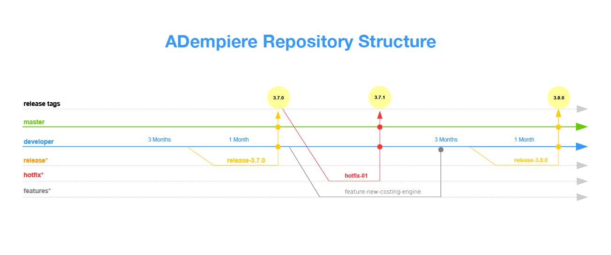
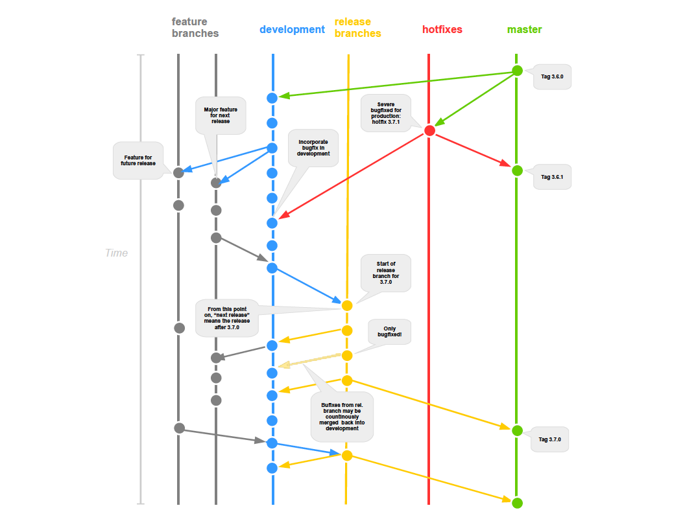
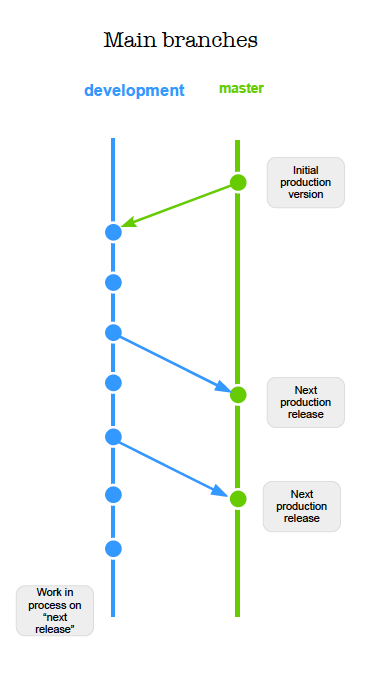
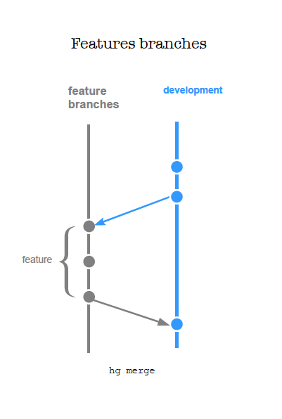
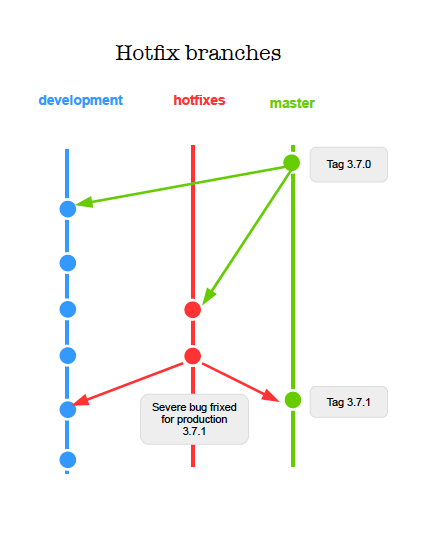

# Software Development Procedure

## Preface

For quite a while, I have been participating in the ADempiere project as a committer. Throughout this time the group of developers has experienced the increasing complexity of managing this project as a mission-critical software development endeavour.

This process has been occasionally not only complex but also tedious, since the philosophy of our project is based on the Bazaar approach, that expects many contributors with different profiles, experience and ways of thinking. So the big question is: how to manage the project with all these contributors?

On the one hand we have contributors \(aka committers\) with great experience in the project. They want to and often do contribute with new features, generating a dynamic line of development. Many of these new features can be brought to our committee for approval and inclusion in the main develop branch.

This process is very important because it lets us review and evaluate new features by experts both technical and functional.

Another important aspect is the incredible ability of contributors to create new features, usually beginning with a creative idea that evolves and matures. After this has happened, the contributor wishes to show his deeds to others to receive feedback and eventually to submit for trial.

The new features can be fully completed or in progress, but it is important to establish a policy of sharing functionality in order to evaluate the pros and cons of the feature.

The process nowadays is complex because there aren't tools and procedures enabling dynamic collaboration. As a consequence of that, the project may be or seem to be stalled or still worse, these new features are never included within the main trunk, limiting the creativity and innovation of the project.

On the other hand there are contributors who discover a problem/bug in the program. They create a solution to the problem in their private repository. In many cases, many of these bug fixes do not land in the main line of code.

Why? In my opinion, it is because of the lack of tools and of a process that explains how to share, how to facilitate collaboration, reviews and evaluation of bug fixes in a simple way.

Another aspect of our software development concerns the release of new versions that include bug fixes as well as new features are approved by the project committees. In the current approach, the main line of code must be frozen during the release process. This simplifies the process for the technical equipment, but has the disadvantage of stopping the momentum of a Bazaar-like project like ours, which is in constant evolution.

The release process also involves steps towards maintaining already released versions. These versions are not fault-free and so it is possible to find errors anew. Thus the versioning process is an additional task for the technical team, and using a tool to facilitate the creation of a service pack becomes a key factor.

Once the major issues were pinpointed, the technical committee analyzed and improved the current development process. As a result of this, changes were made in the current procedure in order to solve the current problems and thus improve collaboration in the project.

Kind regards

[Victor Perez](http://wiki.adempiere.net/User:Vpj-cd)

Member of Technical Team

## Goals

This document is about establishing processes, rules and teams to achieve the following:

* Produce high quality ERP software
* Regular and schedule releases
* An all the time stable “master” branch
* Explicit and concise rules how to manage the ADempiere Code Repository
* Reduce overhead caused by reverts for unfinished features
* Documentation for all new features
* Teams are to be responsible not single persons
* Lean project organisation
* Continuous and reliable progress
* Increase collaboration among developers
* Facilitate the task of project management

## Glossary

Here, a couple of important definitions are introduced shortly to help the understanding of the processes, but explained in detail below:

* **Main branch**
  * **master Branch** \(before: stable\)
    * Only for release and hotfixes approved
    * An infinite lifetime
  * **develop Branch** \(before: development\)
    * Main line of code
    * An infinite lifetime
    * Never freezes.
    * Gets voted and approved commits from features branches.
    * No experiments
* **Support Branches** \(before directly in trunk\)
  * * **Release**
    * **Feature**
    * **Hot Fixes**
    * These branches always have a limited life time
    * Since they will be removed eventually.

## Software Production Cycle

### **Development Phase \(3 Months\)**

* “develop” branch which is the main line of development.
* New functionalities are implemented in separate “feature” branches with the aim to get them into develop branch
  * Developers have 3 months time for integrating new functionalities, changes, Bug fixing and Integration testing in their branch
  * Before integrating new/ changed Functionality in "develop" the Developers/ Implementers have to apply for approval by Technical and Functional Team

### **Stabilization Phase \(1 month\)**

* After development phase is over there is one month stabilization phase where the “release” branch is created and frozen for new features. In this time only bug fixing and User Acceptance Tests \(UAT\) are allowed.

### **Release**

* When “release” branch is finished, it is integrated back into the develop and master branches, which are the main line of development. Eventually, a release is done using a tag.
* The next stabilization branch cycle starts. The old branch is close.

## **Developer Responsibilities**

* Assure that code has 100% compliance with [ADempiere Best Practices \(ABP\)](adempiere-best-practices.md)
* Code is formatted using the official formatting definition \(need to be defined and agreed on, but in meantime you can take this as an example\)
* Respect the Distributed Version Control Best Practices \(see [Committing](http://wiki.adempiere.net/ADempiere_Best_Practices#Committing)\)
* Announce any data model change in order to discuss and vote it in Technical and/or Functional team \(example: the placed were we store some well known data like contact phone changed\)
* Announce structural changes \(e.g. file, directory, rename, move, delete\) should be announced and approved by Technical team before applying it
* Keep Master Data Models \(organizations, business partners, contacts, warehouses etc\) consistent and do not use different ways of defining the relations between this entities \(examples: storing the organization details like addresses, phones, faxes in Organization Info tab or in the linked business partner\)
* In case of complex functionalities, define ADempiere Generic Workflows in order to guide the user how to setup the functionality and which is the designed the business process \(example: take a look at Manufacturing Management Setup workflow from your ADempiere main menu\)
* Provide necessary documentation:
  * Discuss in Gitter \([https://gitter.im/adempiere/adempiere](https://gitter.im/adempiere/adempiere)\)
  * Add a description of the issue/feature to the Adempiere GitHub account \([https://github.com/adempiere/adempiere/issues](https://github.com/adempiere/adempiere/issues)\)
  * When creating a pull-request, provide information on what was fixed and how to test the fix.
* Provide necessary support to fix any issues that may arise while the pull-request is being reviewed.

#### In summary:

* The Maintainer manages the main repository \([https://github.com/adempiere/adempiere\](https://github.com/adempiere/adempiere%29\)
* Developers should have their own account on GitHub.
* Developers fork the main repository on GitHub to their personal account \([https://github.com/&lt;developerAcct&gt;/adempiere](https://github.com/<developerAcct>/adempiere%29\)\) and make a local clone of their personal fork.
* Issues are tracked in GitHub on the main repository.  Commits that relate to that issue should include the hashtag for the issues \(e.g. \#123\).
* Working on their local clone, developers should create a new branch for their work to correct an issue \(for example "fix/\#123\_myfix"\) or create a new “feature” branch.   These should branch from the most resent commits on the target branch that their work will be eventually be added to.  
* Developers commit to their local clone and push to their fork using well documented commits.  Read the Github instructions for more information.
* To have their work merged into the main repository, developers issue a pull request from their GitHub account. This will initiate a discussion with other developers, leading to the inclusion of the new work.


While the main repository will be following the branch naming very closely, developers are encouraged to use more descriptive names for their branches and to develop these "tracking" branches from a recent point on the Adempiere \(origin\) project \(the "target" branch\). The branch should contain only the changes relevant to the pull request and the pull request should target the correct branch on the origin repository. Once the pull request has been accepted and closed the tracking branch can be deleted. \(Branches in git are only pointers so deleting the branch tag leaves all the history intact.\)



While developers can work on any branch, the pull requests have to be made in sequence if more than one is made from a single branch.  This can get confusing.  Even if both pull requests have a single commit, the second one created will include the first making it difficult to reject the first and accept the second.  Best to keep the source for the pull requests on unique branches if possible.


## Teams

### Technical Team

Calculate 4 hours minimum work per week

**Responsibilities**

* Maintains “master” and “develop” branch
* Ensures that all contributions meet technical requirements in respect to quality:
  * Code is well documented
  * Backward compatibility is achieved
  * Migration scripts complete
  * technical documentation sufficient
  * backward comparability analysis
  * migration scripts are provided \(when needed\)
* Regular releases by providing and supporting a release manager from amongst their members

#### Service Pack


Service Packs haven't been used and this section needs more discussion.


The Technical Team agreed to maintain only one Service Pack of a former version. It would be great to support for several years \(typical for this kind of applications\) but our community’s resources are scarce.

A Service Pack can be obtained by comparing the tag of the released version with the last changeset applied by a hotfix from the master branch. This process can be automated via a script that makes a compare and generates a patches.jar which will be applicable to the last version.

**Process**

* When a contribution \(either a bug fix or new feature\) is ready for approval the developer submits a Pull Request on GitHub
* Technical Team meets on a regular basis and discusses the Pull Requests. The team and other developers can collaborate on the pull request if required.
* If all criteria are met the team approves the feature from a technical perspective
* The Maintainer merges the pull request into the main repository.

**Actual Staff \(since March 2016\)**

* Victor Pérez
* Mario Calderón
* Yamel Senih
* Gabriel Vila
* Mike McKay

### **Release Manager**

**Responsibilities**

* Organize contributions to keep release schedule
* Maintains release tags
* Integrate new release branch to master branch

**Process**

* Creates “release” branch from “develop” branch when new development cycle begins
* Produces a release from “develop” branch after stabilization phase
* Creates tags and merge change set into the “develop” and “master” branches

### Functional team

Calculate 4 hours minimum work per week

#### **Responsibilities**

* Ensures that all contributions meet functional requirements in respect to quality
  * Requirement is reasonable
  * Feature is needed in “develop” branch or to be kept as optional extension\*\*
  * Requirement is solved
  * Acceptance criteria are defined
  * Test cases are complete
  * User documentation is sufficient
  * System documentation is sufficient

#### **Process**

* The Functional team has got the final decision on which feature is accepted and merged from “feature” branch to “develop” branch.

#### **Actual Staff \(since March 2016\)**

* Mike McKay
* Jatinder Kansal
* Victor Pérez
* Mario Calderón
* Eduardo López
* Yamel Senih
* Gabriel Vila
* Enrique Ruibal
* Colin Rooney
* Michael Judd

### Other teams

There are already other teams that could be integrated into this Integration Process where it makes sense. For example Usability, Security team.

## **Policies**

### Reverting policy

Code that has been accepted by a pull request but subsequently found to have errors or other problems can be reverted.  This will be done by the repository maintainers with the concurrence of the Technical Team.

### **Team Policy**

#### Voting

* In order to approve a contribution at least 2/3 of team members need to vote positively

#### Membership

* Everybody can become a member of one of the teams
* The team can expel a member when one of the following applies
  * member does not show up for three meetings without informing the other members in advance
  * 2/3 of the team vote for expelling the member

#### Flexibility in this concept

As there might be changes to the version control software \(e.g. switching to mercurial, git\) technical terms \(e.g. trunk\) or best practices might become obsolete. In this case the teams can advance this concept and adapt it to needs of the future. The same applies for duration of cycles that might become a subject to change.

The only thing that the teams are not allowed to change and that is hereby voted and enforced by the citizens is

* Features need always approval before they hit the main line of development to avoid excessively number of reverts  =&gt; Goals "reduce overhead caused by reverts for unfinished features" and "clear rules how to get repository code "
* The aim should always be high quality of the software. If a feature is putting the quality of the ADempiere to risk it should not be approved.  =&gt; Goals "produce high quality ERP software" and "an all the time stable version"
* New features need to be applied with documentation for users and developers  =&gt; Goal "documentation for all new features"
* The power to take decisions and organizing processes should be with teams and not single persons.  =&gt; Goals "teams are to be responsible not single persons" and "lean project organisation"
* Team members need to dedicate a minimum amount of hours per week to the work. They need to agree on that before they become part of the team.  =&gt; Goal "continuous and reliable progress"

If all of above is applied we will have "regular and schedule releases".

## Repository Structure

### The Main Branches

The central repository holds two main branches with an infinite lifetime

* **master**
* **develop**

The **master** branch at origin should be familiar to every developer. Parallel to the **master** branch, another branch exists called **develop**.

We consider origin/master to be the main branch where the source code of HEAD always reflects a production-ready state.

We consider origin/develop to be the main branch where the source code of HEAD always reflects a state with the latest delivered develop changes for the next release. Some would call this the “integration branch”. This is where any automatic nightly builds are built from.

When the source code in the **develop** branch reaches a stable point and is ready to be released, all of the changes should be merged back into **master** somehow and then tagged with a release number. How this is done in detail will be discussed further on.

Therefore, each time when changes are merged back into **master**, this is a new production release by definition. We tend to be very strict at this, so that theoretically, we could use a script to automatically build and roll-out our software to our production servers every time there was a commit on **master**.

### Supporting branches

Next to the main branches **master** and **develop**, our development model uses a variety of supporting branches to aid parallel development between team members, ease tracking of features, prepare for production releases and to assist in quickly fixing live production problems. Unlike the main branches, these branches always have a limited life time, since they will be removed eventually. The different types of branches we may use are:

* Feature branches
* Release branches
* Hotfix branches

Each of these branches have a specific purpose and are bound to strict rules as to which branches may be their originating branch and which branches must be their merge targets. We will walk through them in a minute.

By no means are these branches “special” from a technical perspective. The branch types are categorized by how we use them. They are of course plain old Mercurial branches.

#### Feature branches

* Should branch off from: **develop**
* Must merge back into: **develop**

Branch naming convention: anything except **master, develop,release-\*, or hotfix-\***

Feature branches \(or sometimes called topic branches\) are used to development new features for the upcoming or a distant future release. When starting development of a feature, the target release in which this feature will be incorporated may well be unknown at that point. The essence of a feature branch is that it exists as long as the feature is in development, but will eventually be merged back into **develop** \(to definitely add the new feature to the upcoming release\) or discarded \(in case of a disappointing experiment\).

Feature branches typically exist in developer repository only, not in origin.

**Creating a feature branch**

When starting work on a new feature, branch off from the **develop** branch.

**Incorporating a finished feature on develop**

Finished features may be merged into the **develop** branch definitely add them to the upcoming release.

#### Release branches

* May branch off from: **develop**
* Must merge back into: **develop and** master'
* Branch naming convention: **release-\***

Release branches support preparation of a new production release. They allow for last-minute dotting of i’s and crossing t’s. Furthermore, they allow for minor bug fixes and preparing meta-data for a release \(version number, build dates, etc.\). By doing all of this work on a release branch, the development branch is cleared to receive features for the next big release.

The key moment to branch off a new release branch from **develop** is when development \(almost\) reflects the desired state of the new release. At least all features that are targeted for the release-to-be-built must be merged in to **develop** at this point in time. All features targeted at future releases may not—they must wait until after the release branch is branched off.

It is exactly at the start of a release branch that the upcoming release gets assigned a version number—not any earlier. Up until that moment, the **development** branch reflected changes for the “next release”, but it is unclear whether that “next release” will eventually become 3.6 or 4.0, until the release branch is started. That decision is made on the start of the release branch and is carried out by the project’s rules on version number bumping.

**Creating a release branch**

Release branches are created from the **develop** branch. For example, say version 1.1.5 is the current production release and we have a big release coming up. The state of **develop** is ready for the “next release” and we have decided that this will become version 1.2 \(rather than 1.1.6 or 2.0\). So we branch off and give the release branch a name reflecting the new version number.

After creating a new branch and switching to it, we bump the version number. Here, bump-version.sh is a fictional shell script that changes some files in the working copy to reflect the new version. \(This can of course be a manual change—the point being that some files change.\) Then, the bumped version number is committed.

This new branch may exist there for a while, until the release may be rolled out definitely. During that time, bug fixes may be applied in this branch \(rather than on the **develop** branch\). Adding large new features here is strictly prohibited. They must be merged into **develop**, and therefore, wait for the next big release.

**Finishing a release branch**

When the state of the release branch is ready to become a real release, some actions need to be carried out. First, the release branch is merged into **master** \(since every commit on **master** is a new release by definition, remember\). Next, that commit on **master** must be tagged for easy future reference to this historical version. Finally, the changes made on the release branch need to be merged back into **development**, so that future releases also contain these bug fixes.

Now we are really done and the release branch may be removed, since we don’t need it anymore:

#### Hotfix Branch

* May branch off from: **master**
* Must merge back into: **develop** and **master**
* Branch naming convention: **hotfix-\***

Hotfix branches are very much like release branches in that they are also meant to prepare for a new production release, albeit unplanned. They arise from the necessity to act immediately upon an undesired state of a live production version. When a critical bug in a production version must be resolved immediately, a hotfix branch may be branched off from the corresponding tag on the **master** branch that marks the production version. The essence is that work of team members \(on the **development** branch\) can continue, while another person is preparing a quick production fix.

**Creating the hotfix branch**

Hotfix branches are created from the **master** branch. For example, say version 1.2 is the current production release running live and causing troubles due to a severe bug. But changes on develop are yet in process. We may then branch off a hotfix branch and start fixing the problem.

**Finishing a hotfix branch**

When finished, the bugfix needs to be merged back into **master**, but also needs to be merged back into **develop**, in order to safeguard that the bugfix is included in the next release as well. This is completely similar to how release branches are finished. First, update **master** and tag the release.

The one exception to the rule here is that, when a release branch currently exists, the hotfix changes need to be merged into that release branch, instead of 'develop branch.

Back-merging the bugfix into the release branch will eventually result in the bugfix being merged into **develop** too, when the release branch is finished. \(If work in **develop** immediately requires this bugfix and cannot wait for the release branch to be finished, you may safely merge the bugfix into **develop** as well.\)

Finally, remove the temporary branch.

## Testing ADempiere

ADempiere is tested by a team of volunteers at each major release.

Automated testing of ADempiere is also performed using test scripts that cover the critical functions. For more information, refer to [Adempiere Automated Testing](http://wiki.adempiere.net/Adempiere_Automated_Testing).

## Integrating Bug Fixes

See [managing pull requests](https://help.github.com/articles/using-pull-requests/), [pull requests tutorial](https://yangsu.github.io/pull-request-tutorial/) and [What Is A Pull Request](http://oss-watch.ac.uk/resources/pullrequest).

If you want to fix a bug, follow this process:

1. In your local clone of your adempiere fork in GitHub, switch to the branch you want to change.
2. Execute git pull from the same branch in the  Adempiere project to get the latest code.
3. Checkout the local branch or \(preferred\) create a new branch to hold your changes.
4. Do whatever changes and modifications are required to fix the bug in this branch.
5. Commit the changes with a comment that well describes what was changed.  As much as possible, try to keep the commits limited to Execute git commit -m 'my comments to the bug fixing', with reference to the github site were the bug was created
6. Execute git push
7. In the [github Adempiere page](https://github.com/adempiere/adempiere/) you can create a pull request for this commit using the Adempiere project branch as the target and your modified branch as the source.  The original issue can be closed automatically if the pull request comments include a phrase "Fixes \#123"
8. Other developers can then review your work and recommend it be included in the target branch.

## Bibliography

* [A successful Git branching model](http://nvie.com/posts/a-successful-git-branching-model/)
* [Git cheetsheet](http://www.globallinuxsecurity.pro/static/git/cheetsheet.pdf)
* [GitHub Forking Projects](https://guides.github.com/activities/forking/)
* [GitHub introduction to the Flow model which describes the Pull Requests](https://guides.github.com/introduction/flow/)

