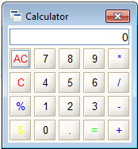
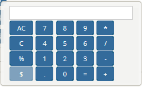
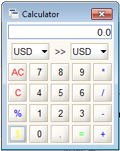

# Calculator Tool

The Calculator Tool is a small and simple calculator that provides simple math support to data entry for number fields.  It is most commonly accessed in Number fields as the helper function.

| Accessed through ... |  In ... |
| :--- | :--- |
| Helper Function | Number Fields  |
| Java Client Menu: | **Tools &gt; Calculator** menu |
| Short Cut Key: | \(none\) |
| Menu Tree | \(none\) |

### Restrictions

None.

### Description

The calculator tool is a simple calculator that provides support for the following operators: + - \* / %. Is also can be used to perform currency conversions by clicking the '$' button. \(Bottom, left. It is hard to see in yellow.\)


The Web Application version of the calculator is simpler and only performs basic calculations.  There is no currency conversion. 


In the Java Client, the calculator can be activated from the **Tools &gt; Calculator** menu entry or by clicking on the calculator icon in any number field.

The calculator can be operated by the mouse but it is most effective with a number pad and keyboard. The behavior between the Java Client and the Web Application is slightly different.

For the Java Client, the following keys are accepted:

* 0-9 - standard digits are added to the end of the display
* In the Java Client, '.' and ',' are both treated as decimals and replaced by '.' in the display. 
* / \* - + operands are added to the end of the display. If there is already an operand in the last position, it is replaced by the one just typed. If there is an operand between two numbers, the calculation is completed before the new operand is added.
*  % operand will divide the displayed number by 100.
* = or &lt;Enter&gt; will complete the calculation. If the calculator was opened from a number field, the equal sign will close the calculator tool and the result will appear in the number field.
* 'A' or &lt;Delete&gt; will clear the display.
* 'C' or &lt;Backspace&gt; will remove the last character typed.
* &lt;Esc&gt; or clicking the red Cancel button will abort the calculation and close the Calculator Tool.
* '$' or clicking the $ button will display the currency conversion buttons. Selecting and double clicking either currency will convert the currently displayed number.

 For the Web Application, the calculator is simpler.

* The 0-9 - standard digits are added to the end of the display
*  / \* - + operands are added to the end of the display. 
*  % operand, if clicked, will divide the displayed number by 100.   If typed into the box, nothing will happen.
* = will complete the calculation. If the calculator was opened from a number field, the equal sign will close the calculator tool and the result will appear in the number field.
* 'A' will clear the display.
* 'C' will remove the last character typed.
* Clicking outside the calculator will abort the calculation and close the Calculator Tool.
* The $ button is disabled.

### See Also

* [Number Field](../entering-data-fields-and-buttons/number-field.md)

