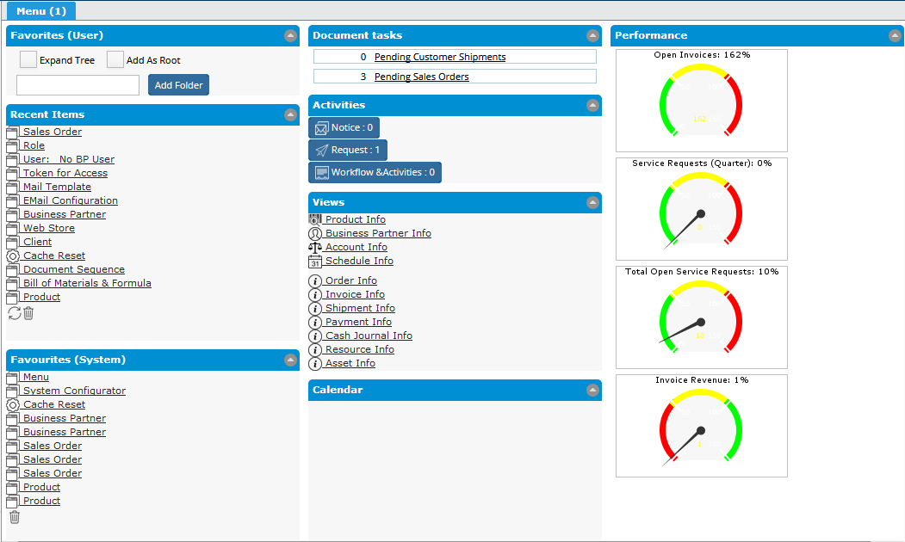
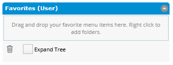
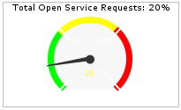
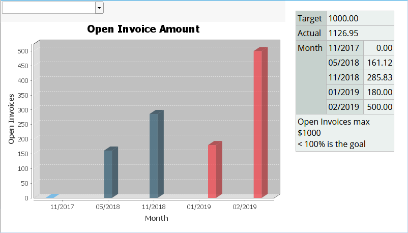
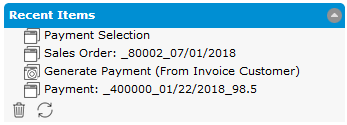
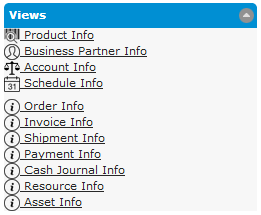
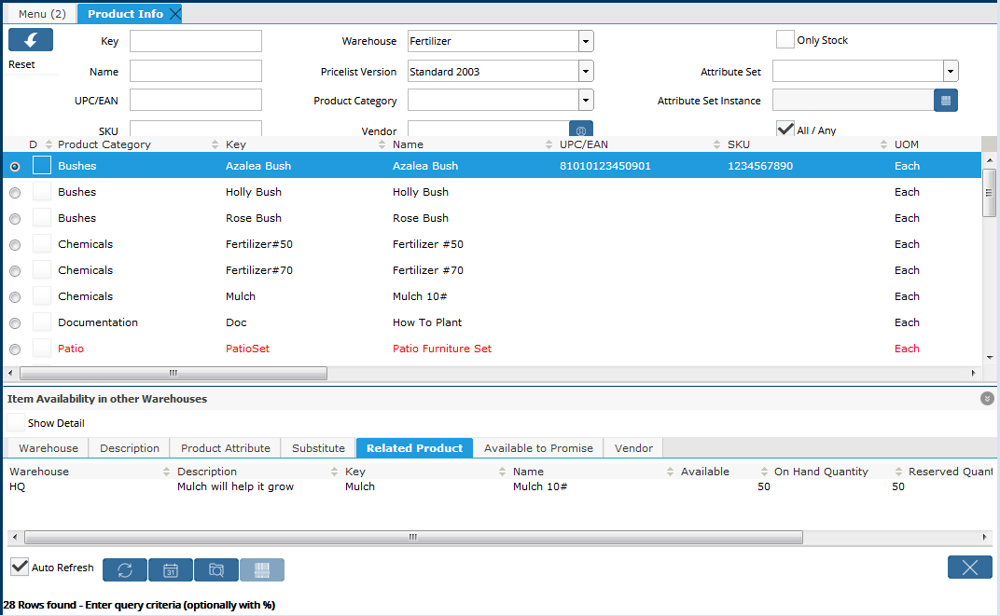

# The Dashboard

The Dashboard can contain a variety of Panels that provide information such as:

* [Activities](untitled.md#activities);
* [Calendar](untitled.md#calendar);
* [Document tasks](untitled.md#document-tasks);
* [Favorites \(User\)](untitled.md#favorites-user);
* [Favorites \(System\)](untitled.md#favorites-system);
* [Performance measures](untitled.md#performance-measures);
* [Recent Items](untitled.md#recent-items); and 
* [Views](untitled.md#views)


Access to Dashboard Items has to be specifically granted for each Role by a Client Administrator. If no access has been granted for the Role chosen at login, the Dashboard will be blank.


Each panel has a header bar and can be collapsed to make room on the screen.

## Activities

The Activities panel has three buttons that provide some of the key information about the tasks that must be accomplished. Beside the text in each button is a number representing the number of items that need attention. The three buttons function as described below.

| Button ... | Opens ... |
| :--- | :--- |
| Notice | The **Notice** window which displays Client and Organization information the user may need.  Notices are raised by the system and may indicate problems that need to be addressed or information that needs to be managed.  The User can choose to receive these "Notes" via email, the **Notice** window or both.  Notices may have Attachments such as spreadsheets or reports relevant to the note. |
| Request | The **Request** window showing items that may require attention.  Requests are typically customer driven and can be for products, services or warranty action and may trigger the creation of other documents such as sales orders. |
| Workflow Activities | The **Workflow** window which shows any active workflows the user is involved with.  Workflows may require approvals or additional actions on the part of the user to complete the work. |


The Menu Tab text "Menu \(1\)" shows the total of the activities that need attention. The number will be updated as new items appear. Keep an eye out for it as you work and return to the Menu Tab to address these activities.


## Calendar

A Calendar can be displayed in the Dashboard. This is an embedded Google calendar which can be used to find dates and to add events to your personal calendar, although they will not appear in this panel.


The Calendar is not configurable. If you need the Calendar to show events, ask your System Administrator. A modification to the application code will be required.


## Document Tasks

The _Document tasks_ panel displays a count of documents with a particular status. Clicking on the link beside the number will open the corresponding window with the relevant documents loaded. The entries in this panel are set in the [**Document Status Indicator**](../../system-administration/managing-organizations/document-status-indicators.md) window. Its likely that the system administrator will set these up for you as it is an advanced task.

## Favorites \(User\)

The User Favorites panel is a list of frequently used menu items that you can select and organize as you wish. Clicking on items in the panel will open the associated menu item. Having these items easily available saves time when looking for a frequently needed menu item.

The pane, when empty, appears as shown in the image below.

You can add items to the Favorites by simply dragging them from the main menu and dropping them into the panel. You can create folders to organize the items by right-clicking in the panel or on an existing item and selecting "Add Folder" from the pop-up menu. The order and structure can be arranged by dragging and dropping items. An item dropped on another item will be placed after it. An item or folder dropped on a folder will cause a menu to appear with options to "Insert After" or "Move Into".

A Folder can be renamed by double-clicking on it. A simple text dialog will open. Edit the text and hit &lt;Enter&gt; to save the new name or close the dialog. Hit &lt;Esc&gt; to cancel.

Folders can also be set to Start Collapsed or Expanded by right-clicking the folder and selecting the corresponding menu entry from the pop-up menu.


The Folders will be created in the language you are using at the time. If you switch to a different language, the folder names will not be translated.


The trash can icon at the bottom of the panel can be used to delete items from the list. Simply drag items from the list and drop them on the trash can. You can also delete items using the right-click pop-up menu.

The Expand Tree check box can be used to expand or collapse the entire tree.

## Favorites \(System\)

Like the Favorites \(User\), the Favorites \(System\) is a list of menu items but these ones are common to all users of the Role.  Items from the menu can be added by dragging and dropping onto the list or deleted from the list by dragging to the trash can icon.

You can only delete the items that you have added.  Items added by other users cannot be deleted.

The items are displayed in the order they appear in the Menu and all at the same level.  


The Favorites \(System\) uses the same list as the Java Client Menu Bar.  However, the Favorites \(System\) panel includes items added from ALL users of the Role.  The Java Client Menu Bar will only show items added by the User.



If multiple users add the same menu item to the Favorites \(System\) or to the Java Client Menu Bar, the menu item will appear multiple times in the list. See issue [\#2355](https://github.com/adempiere/adempiere/issues/2355).


## Performance Measures

Performance Measures provide a quick visual reference to key performance data.  The information presented is specific to your role. What is measured and the assessment of good, mediocre and bad can be configured using any data in the database.  To be most effective, the measures should be very relevant and agreed upon between you and your supervisor.  Like instruments in an aircraft, the indicators should give the you clues as to what you need to focus on and how well you are doing your job.

Performance Measures are configured in the **Performance Analysis &gt; Performance Measurement** menu.  See [Performance Measurement Setup](../../accounting-and-performance-analysis/performance-measurement-setup.md) for more information.

If you click on a Performance Measure Indicator, a window will open that will show the performance measure data in a graph along with a table containing  information about the measure. 

You can click on the graph or on the measurement data in the table to open relevant documents or see more detail about the measurement data.  At the top left is a combo-box that can be used to change the style of chart displayed

## Recent Items

The Recent Items panel is a list of windows/records that have been opened recently.  The entries are ordered with the most recent at the top. Clicking on a Recent Item will open that record, a handy way to return to work in progress.

The size of the list is limited to 50 entries by default but this can be configured for the Client or  User to any number.  \(Have a look at the bottom of the **User Contact** tab in the **My Profile** window.\) If a recent record is deleted, it will be automatically removed from the list.  You can also drag and drop items onto the Trash Can icon to delete them.

Click on the Refresh icon at the bottom left to refresh the display manually.

## Views

Views are special forms that present information in useful ways.  The Product Info view, for example, provides a way to search for products and see quantities in inventory and the expected changes.  The form can be used to provide promise dates to customers or suggest alternative \(substitute\) or complementary products.  The Business Partner info window can be used like a phone or contact list for Business Partners.

The views can be used standalone to find information but they are also connected to search/lookup fields as helper functions.  For example, any search field connected to the Product table will have a helper button that will open the Product Info window.

The Views are similar in layout except for the Account Info and Schedule Info view.  There is a set of constraints at the top to limit the search.  At the top left is a refresh button that will reset the constrains.  In the middle will be one or more tables of information.  At the bottom are buttons that control how the form behaves and that provide some functions such as zoom to the selected entry.

For more information, refer to the section on Views.

