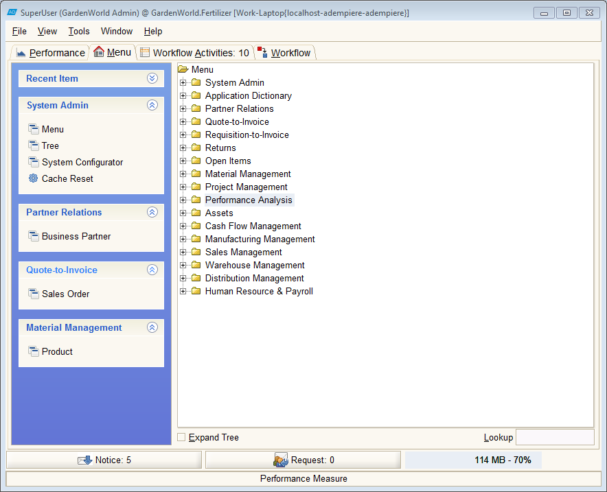
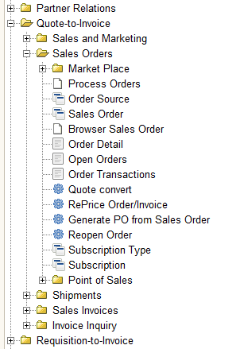
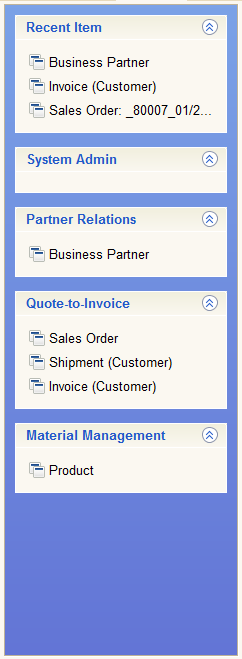

# The Menu \(Home\) Tab

The Menu tab or Home tab contains the main menu tree used to access the windows, forms, reports and processes which make up the application.  The default menu tree has over 800 entries and is challenging to deal with.  The tree structure of the menu can be configured to suit your role so it may not appear as shown and may contain only a few entries relevant to you.

The tree may have summary items which have a folder icon.  You can expand these by clicking on them.  Alternatively, you can select the Expand Tree tool at the bottom left of the menu to open all the summary items.

There are four types of items in the menu differentiated by their icon:

| Icon | Description |
| :--- | :--- |
|   | Window or form - used to enter or view data |
|   | Report - a collection of data that can be printed |
|   | Process - a software tool that performs an action |
|   | Browser - a combination form and process used to select records and perform a process with them. |

Clicking on a menu item will open the window or dialog related to that item.

### Lookup - Finding Menu Items

To find a Menu Item based on its name, use the Lookup tool in the bottom right.

Enter the name or part of the name in the Lookup tool and hit &lt;Enter&gt;.  The Menu will expand to the first matching item. Keep typing &lt;Enter&gt; until the Menu item your looking for is highlighted.  You can open this entry by typing &lt;Ctrl&gt;&lt;Enter&gt;.

### The Menu Bar

To the left of the Menu is a blue area called the "Bar".  You can add your favorite menu items to the Bar by right-clicking on the menu item and selecting "Add to Bar" from the pop-up.  You can remove items from the Bar by right-clicking on them and selecting "Remove from Bar" from the pop-up.

The Bar items will be organized into lists according to the top level menu summary where they were originally found.  At the top of the Bar, a list labeled "Recent Item" will be shown.  This is a list of recently opened menu items. For example, if you opened Sales Order 80007 and updated it, you would see an entry for "Sales Order: \_80007..." in the recent items. Clicking this link will take you back to that record.

The size of the list is limited to 50 entries by default but this can be configured for the Client or  User to any number.  \(Have a look at the bottom of the **User Contact** tab in the **My Profile** window.\) If a recent record is deleted, it will be automatically removed from the list.  

To refresh the Bar, right-click in any of the list areas and select "Refresh the Bar" from the popup menu.

 

