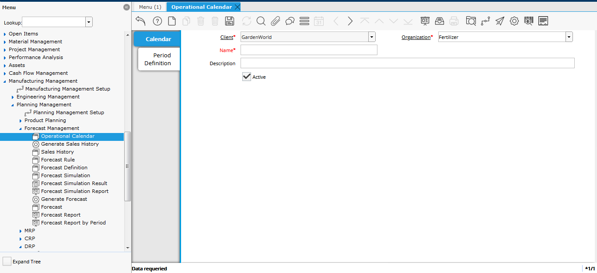
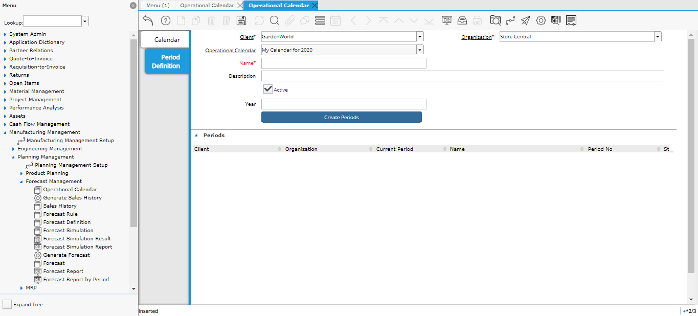
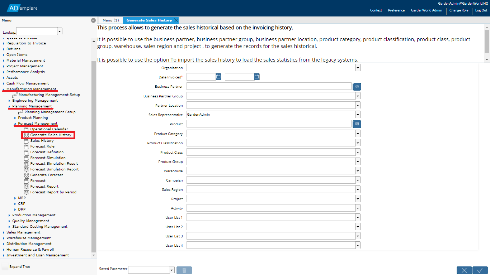

# Forecasting

## Overview

Forecasting is a way to estimate the future quantity and revenue from sales of products or services over a period of time.  Forecasts use quantitative and statistical methods based on historical data and market statistics to predict future sales.

The projected quantities and sales amounts can be used for decision making, pricing, cash flow, estimated future demand, calculating master production schedule, supply plan and future capacity requirements.

A forecast is basically a set of products, quantities and time that shows how much of a particular product will be required or sold at that time.  The forecast data is used by the Material Resource Planning to drive the material planning processes which will trigger purchase demands for raw material and production activity to generate the required products in time to meet the forecast.

Forecasts have several basic components that are discussed in detail below:

1. An **Operational Calendar** which defines the number and duration of the periods that will be used for the forecast.  The periods are forecast buckets or measurement cycles which can be, for example, weekly or monthly periods.
2. The **sales history** on which the forecast is based.
3. A set of **Forecast Rules** which are the various mathematical and statistical processes that can be applied.  Additional rules can be added in software if required.
4. A **Forecast Definition** which defines the parameters required by the Forecast Rules and filters on the historical data.
5. **Simulations** of the forecast which use all the above to calculate forecast amounts.
6. The **accepted forecast** which is generated from the simulations and which can be used in Material Resource Planning to generate demands on the production system.

## Operational Calendar

The operation calendars defined the set of periods that will be used in the forecast calculations and reports.  These periods are like buckets or measurement cycles with a specific duration.    

For planning purposes, the choice of period size depends on your manufacturing and sales turnover time.  Typically, the periods will be weekly or monthly.  Too small periods can result in excessive data that is difficult to deal with.  Periods that are too large can generate manufacturing plans that are not efficient resulting in excessive inventory.  You can create multiple calendars to test which approach works best for your situation.

To define the Operational Calendar open the **Operational Calendar** window in the **Manufacturing Management -&gt; Planning Management -&gt; Forecast Management** menu. 

Create a new record and give it a name and description. Save the record and move to the **Period Definition** tab.

### Period Definition

The **Period Definition** tab, provides a way to create periods to use in the Forecast.  

The main fields here are:

| Field | Description |
| :--- | :--- |
| _**Name**_ | A name for the period definition record.  As you may have several period definitions for a single calendar, the name is used to identify them. |
| _**Description**_ | A description of the period definition if required and helpful. |
| _**Year**_ | The Calendar Year that the periods will start in.  This only applies if a _**Start Date**_ is not set in the **Create Periods** process discussed below.  If a _**Start Date**_ is specified, the "year" used will be the year of that date instead of this field. |


At the time of writing, the _**Start Date**_ parameter is mandatory, making the _**Year**_  field irrelevant. See issue [\#3013](https://github.com/adempiere/adempiere/issues/3013).


#### Creating the Periods

With the Period Definition record completed, the periods are created by clicking the button _**Create Periods**_ below the _**Year**_  field in the **Period Definition** tab.  

The parameters for the process are as follows:

| Parameter | Description |
| :--- | :--- |
| _**Start Date**_ | The start date for the periods. |
| _**Number of Periods**_ | 12 or 52 are allowed, providing monthly or weekly periods. |
| _**Date Format**_ | The period name will follow the date format entered here.  This uses the Java [SimpleDateFormat](https://docs.oracle.com/javase/9/docs/api/java/text/SimpleDateFormat.html) pattern.   |

The Periods begin on the start date specified.  The format pattern should be enough to differentiate the period.  For example, a common format for months would be "yyyy-MM" which would create periods that can be sorted in chronological order by year and month.  For weeks, you might use "yyyy-MM-DD' \('w'\)'" which would give the start date of each week period and the week number in brackets.


If you run the Create Periods process multiple times, it will create multiple versions of the periods.  While you can use this to generate periods over multiple years, you can also duplicate periods within the year if you are not careful.  If you do need to redo the Create Periods process, please delete the existing periods first. See issue [\#3014](https://github.com/adempiere/adempiere/issues/3014).


### Periods

The periods created by the process are listed in the **Periods** tab which is embedded in the **Period Definition** tab.  Each period has a name, period number, start date and end date, which set the date range for the specified period.  You can manually manipulate the periods if required.

## Sales History

The forecasts are created by extrapolating a historical trend.  This trend is defined either by the sales contained in historical invoices or directly from an import of data.  

### Generating Sales History from Invoices

Not every invoice is relevant when it comes to forecasting so the process of creating the history is selective and only copies relevant information from the invoices into the sales history.

The filters used to select the relevant invoices include: 

* business partner; 
* business partner group;
* business partner location;
* product category;
* product classification;
* product class;
* product group;
* Product
* warehouse;
* sales region;
* project; and more

To generate the sales history, run the **Generate Sales History** process found  in the **Manufacturing Management -&gt; Planning Management -&gt; Forecast Management** menu.

As you can see in the image, there are a large number of parameters. Only the _**Date Invoiced**_ range is mandatory. 

### Import sales history Process:

This process enables the import of the sales statistics by using a predefined import format,  inside the application.

The parameters are the default values to import the records.

The maintained information inside the sales statistics are: the business partner data, product, sales quantities, prices, costs and reference values.

The historical sales information is used to realize the forecast calculus and to get sales statistics reports.

### Forecasting Rules:

The Forecasting Rules define the business logic to calculate the forecast according with a previously implemented algorithm.  These rules are used in the Forecast Definition to set the rules and forecast calculation ranges.  The rules can be identified by a name and a description, to identify the different forecast calculation algorithms.

The calculus java class: it’s the implementation of the java interface for each forecast rule.  

Currently the system supports multiple forecast calculation implementations, which are executed by the forecast engine.

The forecast rules are used by the Forecast definition to determine the forecast calculations, based in the following rules:

* Double Exponential Smoothing

#### Forecast Engine.

The forecasting engine has the function to expose the implementations for each forecast rule, the interface ForecastRule.java is the interface to implement each forecast rule.

The developers can use this interface to implement their own calculation algorithms.

### Forecast definition:

This window allows to define the valid combinations, used to select the historic sales records. The combinations order is determined by the sequence, where the lower sequence has priority over the higher sequence.

The information to define combinations are defined by business partner data \(business partner, business partner group, sales region and campaign\), Product data \(product, category, classification, class and group\), factor data for calculus \(Alpha Factor, Gamma, Multiplier, Scale\).

The suitable use of the forecast definition, allows to generate calculus with different factors for each main group of data defined for a business partner or product.

In this way is possible to get a forecast for each product category, different from another.

To set the sequence of the combinations is possible to use the tab of sequences, with which is possible to define the order of each combination.

### Forecast simulation:

The forecast simulation window, allows to define the required parameters to process a forecast calculation, these parameters are used for the forecast engine to extract the data from the sales historical, to execute the calculation algorithm based on the forecast rule and to save the forecast results.

Forecast Definition: Establishes the forecast definition for this simulation.

Forecast Rule: Establishes the forecast rule to calculate this simulation.

Operational Calendar: Establishes the calendar to use, for the base periods definition and the target period definition.

Source Warehouse: Determines the warehouse for which the sales statistics information will be filtered, in this way it is possible to calculate a forecast for an specific warehouse.

Base Period Definition: Defines the basic periods to filter the sales history information.

Target Periods Definition: Defines the target periods, once the simulation process is executed the calculated values are organized in the order of the target periods definition.

Periods Historical: Determines the number of history periods, which must be used for the forecast calculation, the periods number are equivalent to the defined inputs at the operational calendar.

Target Warehouse: Determines the destiny warehouse with which the results are generated. In some enterprises the sales historical is generated for each point of sales, by this field is possible to change the source warehouse to a target warehouse with the goal of consolidate the demand in a target warehouse.

Calculate Forecast: This process allows to execute, by the forecast engine, the calculus algorithm established by the forecast rule, the forecast engine uses the established factors in the forecast definition. The calculated values for each period are saved as result of the simulation.

#### Master of Forecast Simulation:

The records of this tab are generated as result of applying the combinations set in the forecast definition, each master record is a unique combination of product, warehouse, and the forecast factors used for this calculus.

Alpha Factor: This factor is used for the forecast engine and determines the smoothing constant used for some forecast models of exponential smoothing. It hast to be a value in the range of 0.0-1.0

Gamma Factor: This factor is used for the forecast engine and determines the smoothing constant used in second place for some forecast models of exponential smoothing forecast, the Gamma Factor is used to smooth the tendency, it must be a value in the range of 0.0-1.0

Multiplied Factor: This factor is used by the forecast engine and determines the percentage in which the calculated quantity of the forecast is increased or decreased. A negative percentage indicates the quantity is reduced.

Scalar Factor: This factor is used for the forecast engine and determines the percentage to be multiplied or scale a calculated quantity of the forecast, this value must be absolute.

#### Forecast Simulation Detail:

The records of this tab are generated as result of applying the established combinations in the forecast definitions and the number of established periods in the definition of basic periods for each master of forecast simulation, a detail record is created for each period accumulating the invoiced quantities between the range of the start and the period end date.

#### Forecast simulation line:

Shows the source of the sales historical for each detail.

#### Results of the Forecast Simulation:

The records on this tab are generated by the execution of the Forecast Engine, using the implemented algorithm in the Forecast Rule, a record is created for each established period in the target periods definition.

The Forecast Engine uses the Forecast Simulation Detail, the Forecast Rule and the factors, to calculate a resultant forecast for each target period, this allows to use the sales historical of the previous year and to calculate the current year sales forecast.

### Forecast Simulation Result:

The forecast simulation browser allows to compare base period data with the simulation result of the target period, after executing a forecast simulation. The goal of this query is to validate that the results are considered in the company plans.

### Forecast Simulation Report:

This process generates a report containing the result of the forecast calculation, parameters can be used to filter the result of the report. The main goal of this report is to evaluate and analyze the result of multiple simulations to determine the most adequate, to be able to generate the forecast.

### Generate Forecast Process:

This process allows to generate a forecast based on the forecast simulation calculation.

The process uses the resulting simulation values ​ to generate a new forecast.

Action Type of the forecast:  It Indicates how the forecast will be generated

If the action type is "Replace" all lines of this forecast are going to be  eliminated and will be generated again, based on the simulation products and the selection criteria.

If the action type  is "Merge" all lines of this forecast will be combined, based on the unique combination of product, warehouse and period. Therefore, if the combination exists, the forecast quantities are accumulated.

The Load Type of forecast: Indicates which date of the period will be used to determine the forecast line promised date.

Options:

To Use the Period Start Date: The due date is set  based on the period start date

To Use the Period End Date:  The due date is set based on the period end date.

Days after the due date:  Indicates the number of days to be added or subtracted to the due date. If the value is negative, the days are subtracted.

#### Selection Criteria:

It is possible to use the category, classification, class and group of the product to get the products to be included in the new forecast.

### Forecast:

The Forecast window allows to maintain the sales forecast information for an organization.

Inside the forecast window the field  Price List has to be defined to determine the sales goal amounts and to obtain an estimated value for the sales plan by sales representative.

The Forecast report show the Sales Plan , the goal amounts which has to be accomplished, the information to be grouped by sales representative, product, warehouse and period.

The field Operational Calendar and Periods Definition, must be defined to determine the delivery promised date for the forecast products.

The forecast lines can be captured manually entering the sales representative, product, warehouse, quantity, period or it can be generated from a simulation using the Generate forecast process.

The products and its quantities are considered by MRP when  the forecast is already  processed, ADempiere allows to have several forecast simultaneously.

If you don’t want that MRP considers a Forecast processed,  it should be deactivated.

### Forecast Report:

This process generates a sales forecast detailed report, classified by sales representative, product warehouse, period and promised date, these parameters can be used to create filters at the report result.

The main goal of this report is to analyze the sales plan, considering quantities and amounts.

### Forecast Report by Period:

This process generates a report summarized by forecast period , some parameters can be used to filtrate the report results.

The main goal of this report is to analyze the sales plan, considering quantities and amounts by an specific period.

