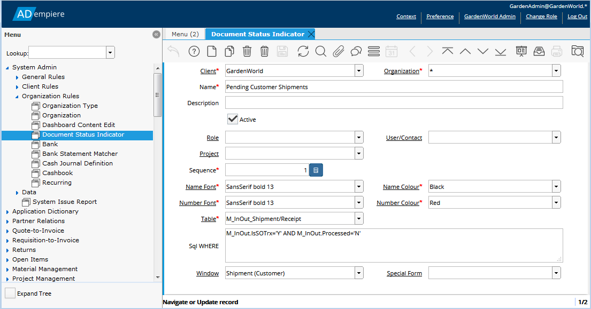

# Document Status Indicators

The Web Application dashboard includes a panel showing Document Tasks as shown below.

The information displayed to the User is configured in the **Document Status Indicator** window in the **System Administration &gt; Organizational Rules** menu. Access to the Document Tasks panel in the Dashboard also has to be enabled for the User in the **Role** window, **Dashboard Access** tab found in the **System Administration &gt; General Rules &gt; Security** menu.


Configuring Document Status Indicators requires an understanding of the underlying database tables and columns which represent "documents" in ADempiere and SQL queries.


There can be many Document Status Indicator records for an Organization or Client. The selection of which indicators are displayed to a particular User is based on the following:

* Only _**Active**_ indicators are shown
* From the same _**Client**_
* Where the _**User/Contact**_ field is blank or matches the User
* AND where the **Role** field is blank or matches the User's Role.

The sequence that the indicators are shown in is determined by the _**Sequence**_ field, with lower numbers being shown first.

The _**Table**_ **\*\*field identifies the document of interest and the \_**SQL Where _**field selects the relevant document records from the**_ Table\*\*\_.

The display in the Document Tasks panel is a count of the documents of interest. The link beside the number is based on the _**Name**_ field.


The name field is not translated.


The count of the documents and the link to those documents is made using an SQL Where clause that is constructed from the _**SQL Where**_ field plus a few other constraints:

* Only documents within the same _**Client**_
* If the _**Organization**_ field is not All \(**\***\), then only documents that match the _**Organization**_
* If the **Projec**t field is not blank, then only documents that match that **Project**

If the User clicks on a status indicator and a _**Window**_ is specified, the window will be opened and loaded with the selected documents. If the _**Window**_ field is blank and the _**Special Form**_ field identifies a form, the form will be opened and loaded with the documents.


If both the _**Window**_ and _**Special Form**_ fields are blank, nothing will happen when the User clicks on the link in the Document Status panel.



The _**Name Font**_, _**Name Color**_, _**Number Font**_ and _**Number Color**_ fields are not used.


## Example - Unpaid AR Invoices

As an example using the Garden World client, assume that Garden User needs to see unpaid invoices to ensure payment allocations are made and to personally dun \(collect\) the amount owed. The GardenAdmin user is not interested in this. The Document task panel for the GardenUser should look like the following:

1. Login as GardenAdmin and the GardenAdmin role.
2. Open the **Document Status Indicator** window and create a new record.  Set the fields as follows and save the record.:
   1. _**Client**_ - will default to Garden World
   2. _**Organization**_ - \*
   3. _**Name**_ - Unpaid Invoices
   4. _**User**_ - GardenUser
   5. _**Sequence**_ - 10
   6. _**Table**_ - C\_Invoice
   7. _**SQL Where**_ - C\_Invoice.IsSOTrx='Y' AND C\_Invoice.DocStatus='CO' AND C\_Invoice.IsPaid='N' AND PaymentTermDueDays\(C\_Invoice.C\_PaymentTerm\_ID, C\_Invoice.DateInvoiced, getdate\(\)\) &gt; 0
   8. _**Window**_ - Invoice \(Customer\)
3. Verify that a **Dashboard Content Edit** entry exists for the _Document tasks_. The System Client entry will do.
4. Open the **Role** window and find the record for the _GardenWorld User_ role.
   1. In the **Dashboard Access** tab, add an entry and set the _**Dashboard Content**_ to _Document tasks_, if it doesn't already exist. Save the record.
5. Verify that there are paid and unpaid/due customer invoices in the system. Create some if necessary.
6. Log in as GardenUser and verify that the _Document tasks_ panel shows the correct number of unpaid invoices.  Click on the link and ensure that only unpaid invoices appear in the **Invoice \(Customer\)** window when it opens.
7. Make a full payment to one of the invoices.  Return to the dashboard and verify that the _Document tasks_ entry has been updated. \(Note that it may take a minute to update.  The dashboard refresh happens every 60 seconds.\)
8. Log in as GardenAdmin, verify that the "Unpaid Invoices" item does not appear in the _Document tasks_ panel.

   .

